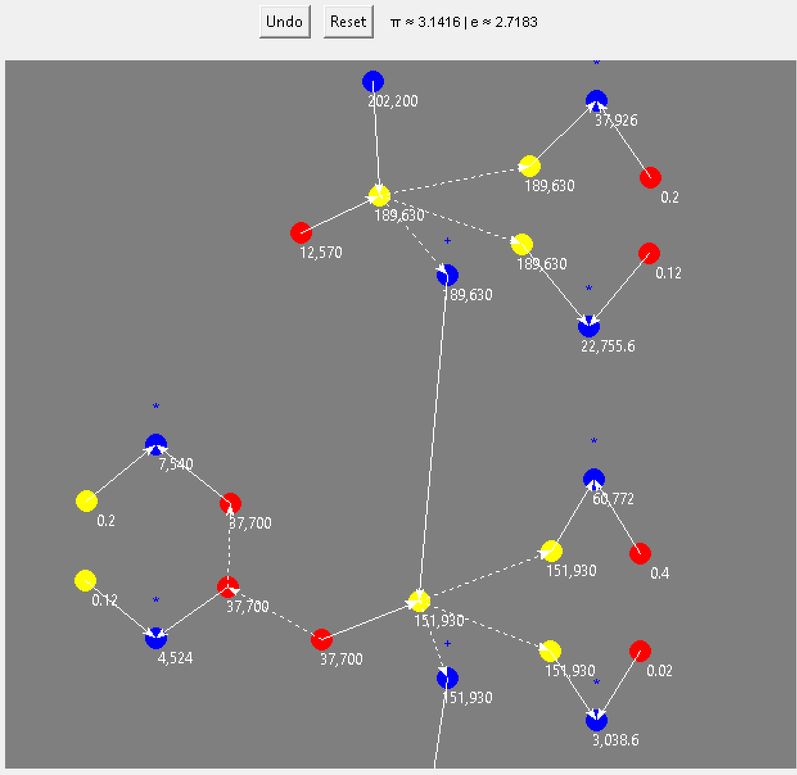

```markdown
# VisioMath



VisioMath is an interactive Python-based whiteboard application built with Tkinter for exploring mathematical concepts through visual, node-based computations.

This README explains how to open, run and use the project locally, plus troubleshooting and development tips.

## Quick summary

- Language: Python 3.8+
- GUI: Tkinter (no other third-party libraries required)
- Main script: `whiteboard1.py`
- Free features: core operations (add, multiply, log), text notes
- Premium features: timers, custom deltas, Riemann sums (requires a PREMIUM_KEY)

## Requirements

- Python 3.8 or newer
- Tkinter (usually included with Python, but see Troubleshooting below)

## Clone and run (recommended)

1. Clone the repo:
   ```bash
   git clone https://github.com/6049278-art/VisualMath.git
   cd VisualMath
   ```

2. (Optional but recommended) Create and activate a virtual environment:
   ```bash
   python -m venv venv
   # macOS / Linux
   source venv/bin/activate
   # Windows (PowerShell)
   .\venv\Scripts\Activate.ps1
   # or Windows (cmd)
   .\venv\Scripts\activate.bat
   ```

3. Run the app:
   ```bash
   python whiteboard1.py
   ```

No extra pip installs should be necessary if Tkinter is present.

## Windows / macOS / Linux notes

- Windows: Python installer usually includes Tkinter. Run the commands from a Command Prompt or PowerShell.
- macOS: Use the system Python from python.org or Homebrew-installed Python. If the bundled Tk isn't working, install the latest Python from python.org (it includes a proper Tcl/Tk).
- Linux (Ubuntu/Debian): You may need to install `python3-tk`:
  ```bash
  sudo apt update
  sudo apt install python3-tk
  ```

## Premium features (optional)

If you have a premium key, set it in your environment before running:

- macOS / Linux:
  ```bash
  export PREMIUM_KEY='your_key_here'
  python whiteboard1.py
  ```
- Windows (cmd):
  ```
  set PREMIUM_KEY=your_key_here
  python whiteboard1.py
  ```
- Windows (PowerShell):
  ```
  $env:PREMIUM_KEY = 'your_key_here'
  python whiteboard1.py
  ```

The app will detect the environment variable and unlock timers, Riemann sums, and custom deltas.

## How to use (controls cheat-sheet)

- Spawn a unit:
  - Ctrl + Double-Click on the canvas → creates a unit with yellow/red inputs and blue output.
- Move:
  - Drag blue points to reposition. Use Shift+Click to select multiple and drag groups.
- Edit values:
  - Double-click a value label to edit; press Enter to confirm.
  - Scroll over a label to increment/decrement (default step 0.1 in free version; custom step in premium).
- Link outputs:
  - Ctrl + Alt + Click two blue outputs to link them with a dashed white arrow. Changes propagate; the app prevents cycles.
- Operations:
  - Right-click a blue node to enable operations:
    - Addition (+), Multiplication (*), Log/Root/Base and inverses.
- Riemann sums (premium):
  - Right-click a blue node → "Riemann Sum" and scroll over yellow to accumulate values. Reports appear on the left with history and totals.
- Timers & deltas (premium):
  - Right-click red/yellow nodes for "t" (auto +1/sec) or "delta" (custom step).
- Arrow/links:
  - Double-click arrows to reverse links (solve for x).
- Undo & Reset:
  - Undo last unit; full Reset clears the canvas.
- Text notes:
  - Double-click blank canvas to add an editable multiline note; drag using the black handle dot.

Look for in-app tooltips for contextual help and the demo video (if included in the repo) for additional guidance.

## Troubleshooting

- "No module named tkinter" or Tkinter errors:
  - On Linux, install `python3-tk` (see above).
  - On macOS, prefer the official python.org installer that includes compatible Tcl/Tk.
- App doesn't start / displays exceptions:
  - Run `python whiteboard1.py` from a terminal to see exception output and stack traces.
  - If using a virtual environment, ensure it's activated and `python` points to that environment.
- Blank window or widgets not showing:
  - Check Python/Tkinter versions; mismatched Tcl/Tk can cause display issues on macOS.

## Development / Opening the code in an editor

- Open the project folder in your editor or IDE (VS Code, PyCharm):
  - VS Code: `code .`
  - Look for `whiteboard1.py` as the entry point. Browse other .py files to understand components (nodes, links, UI helpers).
- To debug, add print/logging statements or run the script in the debugger.

## Contributing

Contributions are welcome. Please follow these steps:
1. Fork the repo.
2. Create a feature branch: `git checkout -b my-feature`.
3. Make changes and run the app locally to verify behavior.
4. Open a PR describing your changes.

See CONTRIBUTING.md (if present) for more detail.

## License

Apache License 2.0

## Authors

BlueYellowline

If something is unclear or you want, I can:
- open a pull request adding this README to the repo, or
- paste a shorter Quick Start section into the existing README instead.
```
